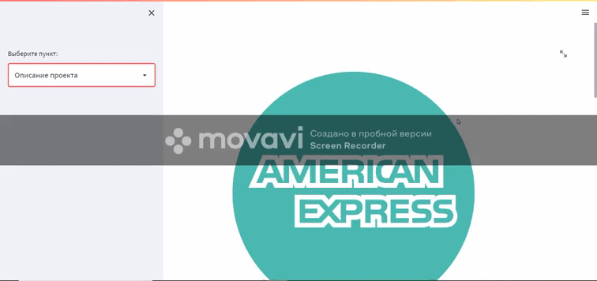

# American-Express-Service
Сервис по предсказанию возврата долга компании American Express сделанный на основе соревнования на сайте Kaggle [American Express - Default Prediction](https://www.kaggle.com/competitions/amex-default-prediction/).
Ввод данных возможен в 2-х вариантах: указывать значение признаков в ручную или загрузить файл с расширением .ftr.

Содержание проекта:
*   /backend - backend часть проекта;
*   /config - папка содержит конфигурационный файл с гиперпараметрами модели;
*   /data - содержит тренировочные данные и промежуточные данные при обучении модели;
*   /demo - GIF запись работы сервиса
*   /frontend - frontend часть проекта;
*   /models - сохраненные модели;
*   /notebooks - jupiter notebook с исследованиями данных и построения модели;
*   /report - сохраненные метрики.

Ноутбуки по соревнованию на Kaggle находятся [тут.](https://github.com/dsv43b/American-Express-Kaggle)

